# Machine Learning Assignment

## Part 1

**What is the purpose(s) of transforming image data? (2 pts)**

>You can correct for biases that may otherwise affect what the model is trained on (e.g., color alterations allow for less bias towards color, such as if a specific color of sky or ocean happens to be more common for specific whales).

**What is the difference between image size and torch image size? (2 pts)**

>Image size is the two-dimensional size of the rasterized image in pixels, while torch size has an additional dimension to account for channels per pixel.

**Add a new transformation to the training data. After your first run of this model during class time, resize the image to 224x224 pixels. (2 pts)**

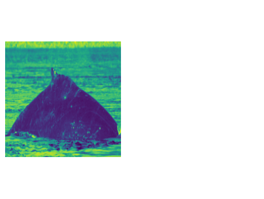

**How did your transformation impact the images? (1 pt)**

>The transformation slightly distorted the color of the image.

**What is the impact of the class weight on how data is loaded into the model? What does it mean if a class has a low vs high weight? (2 pts)**

>Class weight is a way for the model to adjust for class imbalance by assigning weights that are inversely proportional to the observations of that class in the training data.

**How would model training be impacted if we decreased our learning rate? What about if we increased it? (2 pts)**

>If we decreased the learning rate, the model training would be faster but there is a greater risk of overfitting the model to the data. If the learning rate was increased, the training would take longer but less likely to overfit in the same amount of time.

**What is your starting accuracy and final accuracy? What happened to the model to change the accuracy from epoch 1 to 5? (2 pts)**

>The starting accuracy was around 18.75%. The model repeatedly trained on the data throughout each epoch, resulting in a final accuracy of 83.18% by the fifth epoch.

|||
|-|-|
|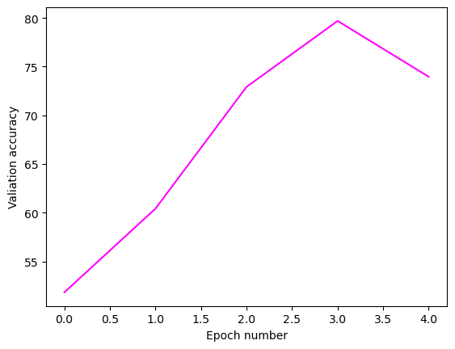|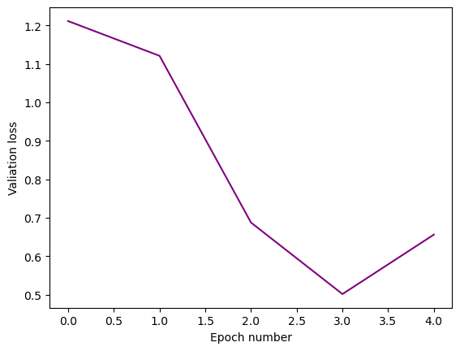|

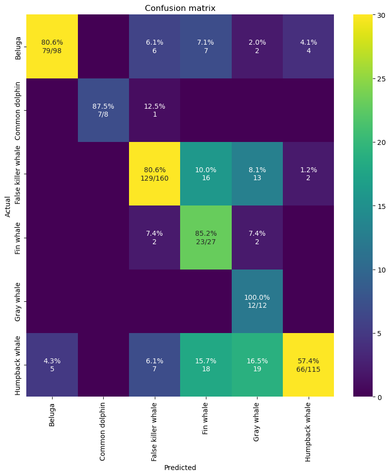

**Does the integrated gradient show what types of features the model used to classify the images? Do you notice any potential problems? (2 pts)**

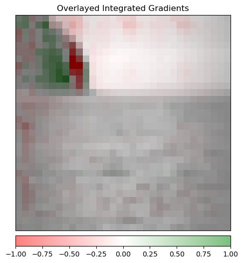

>In some integrated gradient images, it appears that the model is registering land as what could be a whale. This means that this could be a potential problem as the model is training on incorrect information.

## Part 2

### Overview

For this series of a models, I wanted to examine the relationship between epochs and learning rate. The specific values of parameters and results are listed in the table in the [summary](#summary) section.

I reasoned that performing more epochs requires less of a high learning rate. However, I wanted to examine how these parameters impact the resulting accuracy and loss.

### Model 1

**Describe your changes to the model training process (either changing something about the model, a hyperparameter, how data was inputted into the model, or another aspect) and why you selected those changes.**

See the [summary](#summary) for the parameters used for Model 1; these parameters were chosen as a baseline to have a starting point of reference for increasing epochs and decreasing learning rates.

|||
|-|-|
|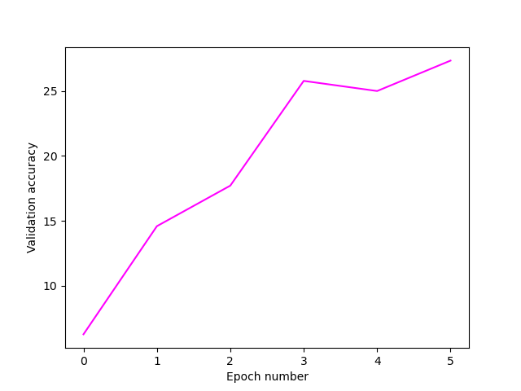|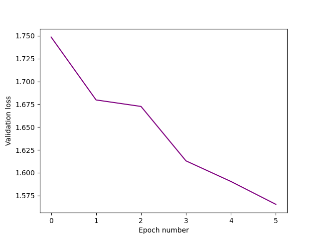|

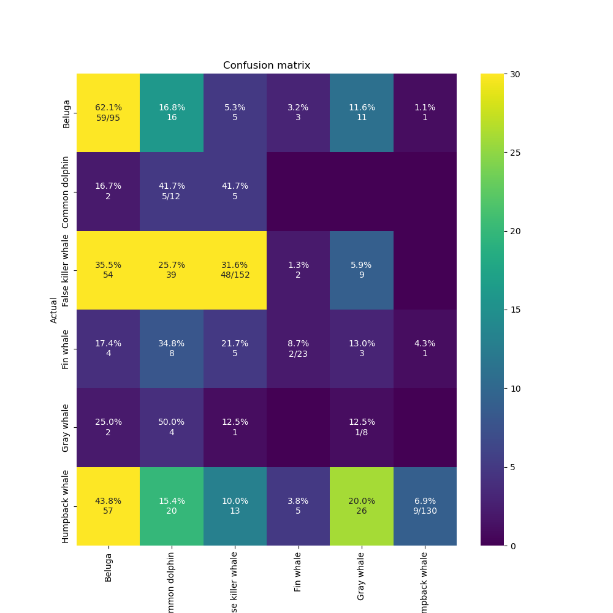

**Were your changes successful? Do you have ideas why your changes were successful or not?**

>Compared to the model from [Part 1](#part-1), this model was much less accurate in spite of the extra epoch provided. This is most likely due to the significantly higher resolution, having been increased to 224x224, necessitating more processing time to achieve similar results.

### Model 2

**Describe your changes to the model training process (either changing something about the model, a hyperparameter, how data was inputted into the model, or another aspect) and why you selected those changes.**

See the [summary](#summary) for the parameters used for Model 2. This decreased learning rate by a factor of 10 and increased the number of epochs by 50% relative to [Model 1](#model-1).

|||
|-|-|
|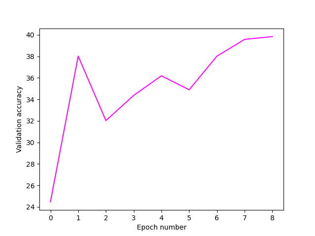|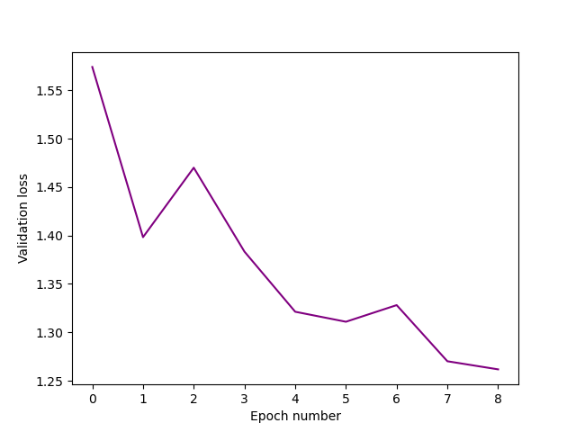|

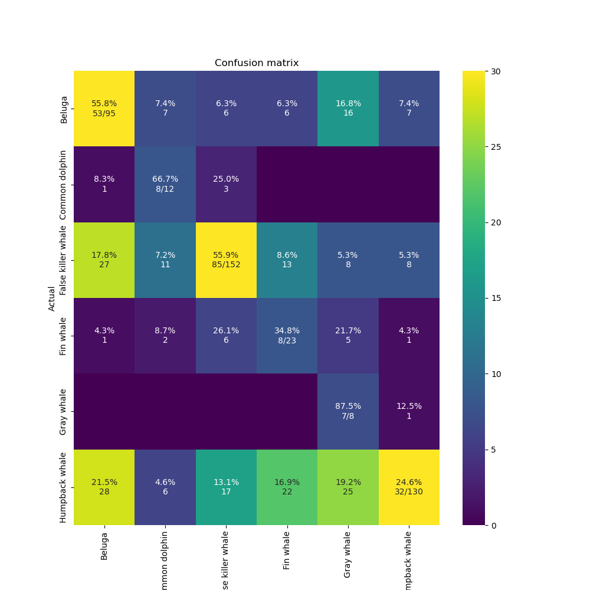

**Were your changes successful? Do you have ideas why your changes were successful or not?**

>These changes were fairly successful as the validation accuracy increased substantially while validation loss decreased relative to [Model 1](#model-1).

### Model 3

**Describe your changes to the model training process (either changing something about the model, a hyperparameter, how data was inputted into the model, or another aspect) and why you selected those changes.**

See the [summary](#summary) for the parameters used for Model 3. This further decreased learning rate by a factor of 10 and increased the number of epochs by 33.3% relative to [Model 2](#model-2).

|||
|-|-|
|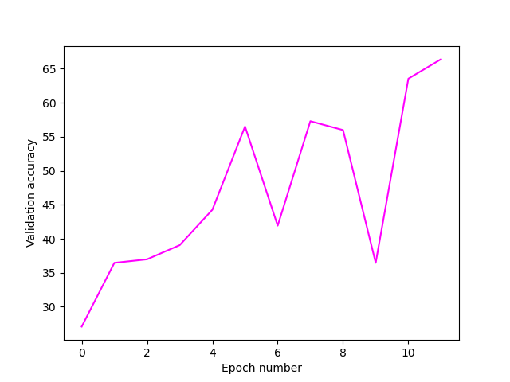|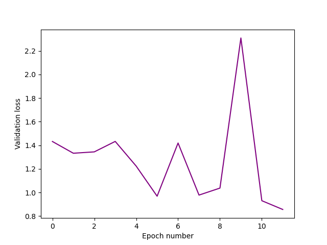|

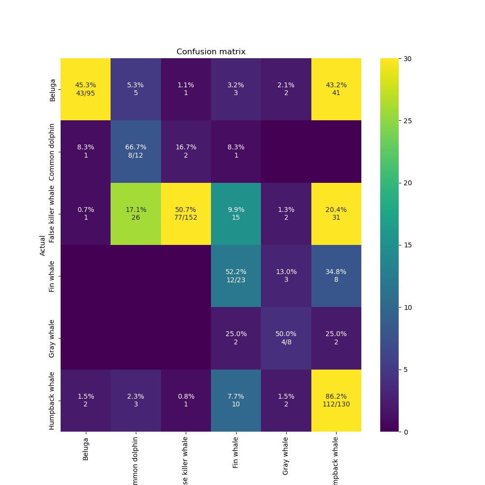

**Were your changes successful? Do you have ideas why your changes were successful or not?**

>These further changes were also fairly successful as the validation accuracy substantially increased again while validation loss decreased relative to [Model 2](#model-2).

### Summary

**Summarize your 3 steps, their success, and what you learned (5 pts)**

|Model|Epochs|Learn Rate|Batch Size|Optimizer|Image Resolution|Accuracy|Loss|
|---|---|---|---|---|---|---|---|
|1|6|0.0001|48|SGD|224|27.34%|1.57%|
|2|9|0.001|48|SGD|224|39.84%|1.26%|
|3|12|0.01|48|SGD|224|66.41%|0.86%|
|4|15|0.1|48|SGD|224|*NA*|*NA*|

>[!NOTE]
>These NA values are from the model failing to complete training within the allotted time.

From this series of models, we can see that this trend of increased epochs and slower learning rate overall improves the accuracy of the model. If this trend were continued, it is likely that it would either reach an inflection point and start to decrease in accuracy, or possibly become overfit as a result.

From this assignment, I learned how to more appropriately tune models to find ideal parameters based on the dataset (e.g., high resolution versus low resolution). I also learned how each parameter affects the model in a more in-depth manner than I had understood previously.
